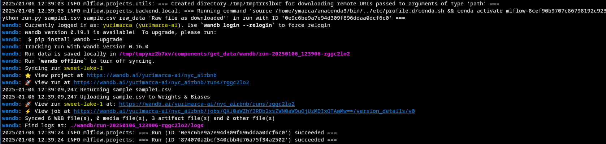
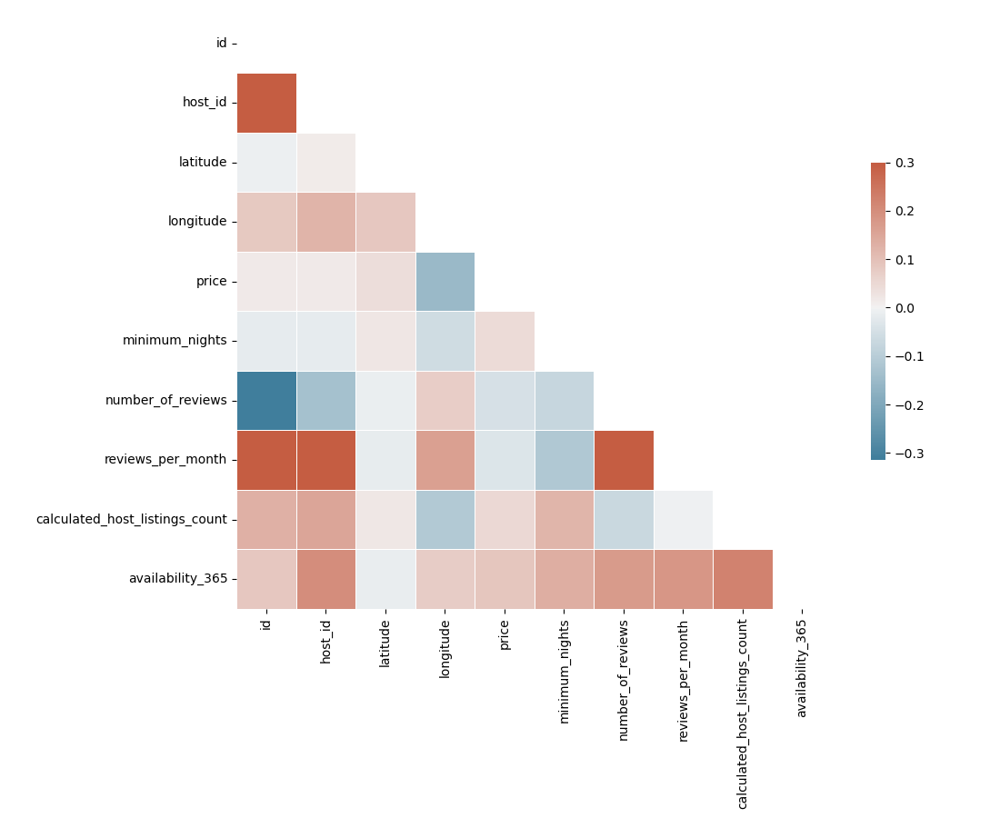
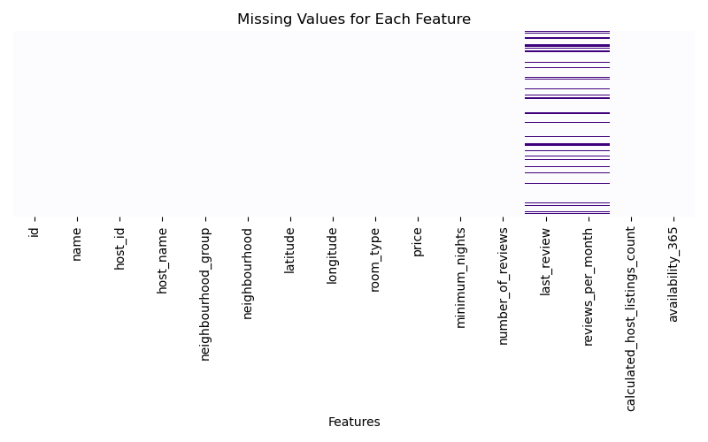

# Short-Term Rental Price Prediction Pipeline in NYC

## Project Overview

This project builds an **end-to-end Machine Learning pipeline** to estimate rental prices for short-term stays in New York City. The pipeline focuses on data preparation, modeling, testing, and deployment to ensure it can be easily reused for weekly retraining.

---

## Table of Contents

1. [Project Setup](#project-setup)
2. [Pipeline Steps](#pipeline-steps)
3. [Environment and Tools](#environment-and-tools)
4. [Step-by-Step Implementation](#step-by-step-implementation)
5. [Model Training and Optimization](#model-training-and-optimization)
6. [Testing and Deployment](#testing-and-deployment)
7. [Results](#results)
8. [Releasing and Running the Pipeline](#releasing-and-running-the-pipeline)
9. [Lessons Learned](#lessons-learned)

---

## Project Setup

### 1. Operating Systems

This project was ran on Fedora Linux 38 (Sway), Kernel: 6.8.9-100.fc38.x86_64

### 2. Fork the Starter Kit

This project has a starter kit that was forked from the official repository.

```bash
git clone https://github.com/yurimarca/build-ml-pipeline-for-short-term-rental-prices.git
cd build-ml-pipeline-for-short-term-rental-prices
```

### 3. Create the Environment

The provided `environment.yml` was used to set up the Conda environment:

```bash
conda env create -f environment.yml
conda activate nyc_airbnb_dev
```

### 4. Login to Weights & Biases (W&B)

Log in to W&B to track experiments:

```bash
wandb login [your_API_key]
```

---

## Pipeline Steps

The pipeline includes the following steps:

1. **Exploratory Data Analysis (EDA)**
2. **Basic Data Cleaning**
3. **Data Testing**
4. **Train-Validation-Test Split**
5. **Model Training (Random Forest)**
6. **Hyperparameter Optimization**
7. **Model Selection and Testing**
8. **Pipeline Visualization**
9. **Pipeline Release**

---

## Environment and Tools

- **Python 3.10**: Required version.
- **MLflow**: Manages experiments and pipeline runs.
- **Hydra**: Handles configuration.
- **Weights & Biases (W&B)**: Tracks artifacts and experiments.
- **ydata-profiling**: Automates EDA.
- **Scikit-learn**: For Random Forest model training.

---

## Step-by-Step Implementation

The following steps are conducted to builds an end-to-end Machine Learning pipeline. 

The initial code contains some pre-existing components that are fundamental for most pipelines, including a step to download data (`get_data`).


```python
_ = mlflow.run(
                f"{config['main']['components_repository']}/get_data",
                "main",
                version='main',
                env_manager="conda",
                parameters={
                    "sample": config["etl"]["sample"],
                    "artifact_name": "sample.csv",
                    "artifact_type": "raw_data",
                    "artifact_description": "Raw file as downloaded"
                },
            )
```

### 1. Exploratory Data Analysis (EDA)

- **Run the `download` step** to fetch raw data so we can it available for EDA. 

   ```bash
   mlflow run . -P steps=download
   ```

	- By calling the above command, mlflow runs the pre-existing component `get_data` according to `main.py` file. 
	- This command highlights the benefit of having hydra configuration.


	
- **Perform EDA** using a Jupyter Notebook:

   ```bash
   mlflow run src/eda
   ```

	In the notebook:
	- I utilize the package `ydata-profiling` to quickly analyse the data.
	- I tried to export the profile report to html and log it as an artifact in Weight and Biases, but I discovered I can't visualize html in W&B.
	- The profile report helped to quickly check the correlation between features and identify missing values.
	- After evaluating the report and removing outliers according to price range from stakeholders ($ 10 ~ $ 350), we obtained a skewed price.
	- Even after removing data outside price range, we still got 19.78% of data rows containing at least one `NaN` column values.







### 2. Basic Data Cleaning

- **Generate the `basic_cleaning` step using cookiecutter** by leveraging the template `cookie-mlflow-step` to rapidly generate an empty step of the pipeline.

```bash
> cookiecutter cookie-mlflow-step -o src
step_name [step_name]: basic_cleaning
script_name [run.py]: run.py
job_type [my_step]: basic_cleaning
short_description [My step]: A very basic data cleaning
long_description [An example of a step using MLflow and Weights & Biases]: Download from W&B the raw dataset and apply some basic data cleaning, exporting the result to a new artifact
parameters [parameter1,parameter2]: input_artifact,output_artifact,output_type,output_description,min_price,max_price
```

- Next, the `basic_cleaning` step was added in the `main.py` file, where it calls the source code using mlflow and hydra.

```python
if "basic_cleaning" in active_steps:
    _ = mlflow.run(
        os.path.join(hydra.utils.get_original_cwd(), "src", "basic_cleaning"),
        "main",
        parameters={
            "input_artifact": "sample.csv:latest",
            "output_artifact": "clean_sample.csv",
            "output_type": "clean_sample",
            "output_description": "Data with outliers and null values removed",
            "min_price": config['etl']['min_price'],
            "max_price": config['etl']['max_price']
        },
    )

```

- In the `run.py` file, sample data is filtered according to the defined price range (hydra config). Also, duplicated data is removed.
- Results show there are many NaN cells still present in the dataset, as we noticed during EDA.


## License

[License](LICENSE.txt)
