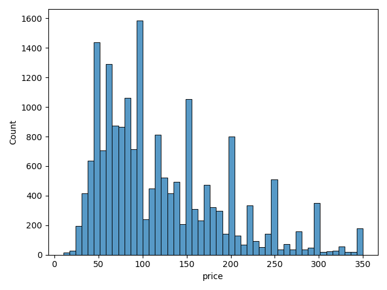
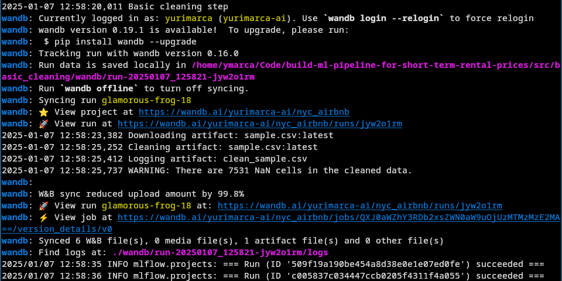
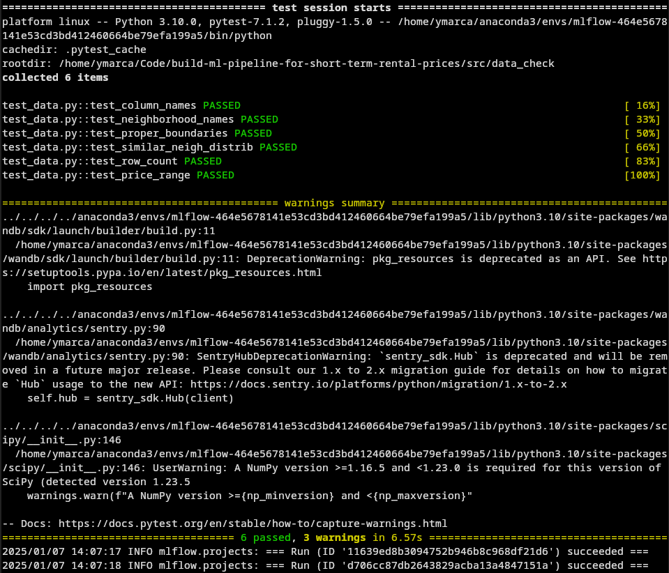
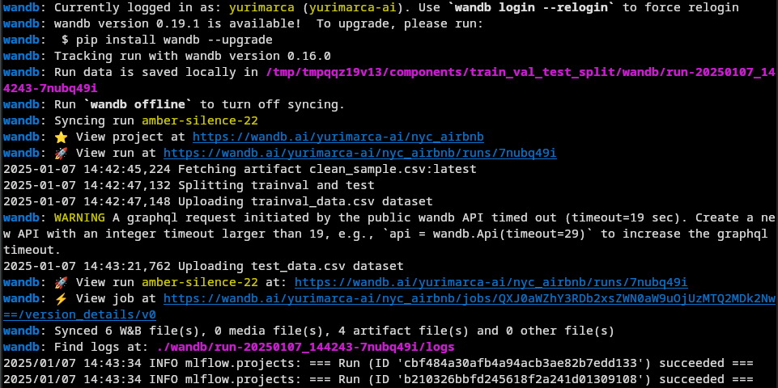
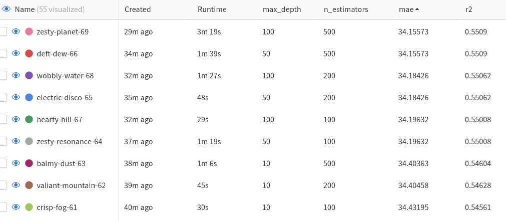
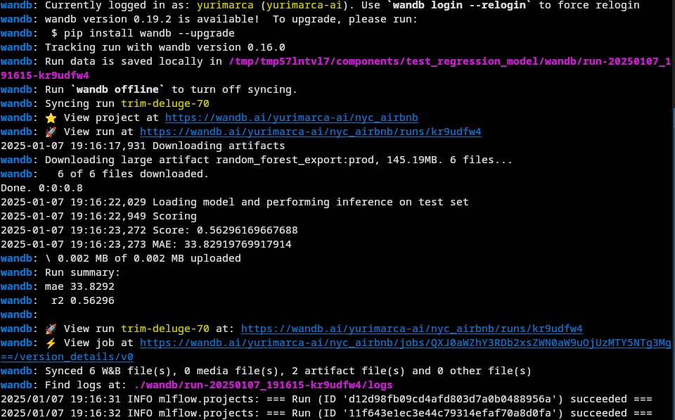
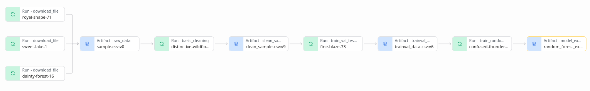

# Short-Term Rental Price Prediction Pipeline in NYC

## Project Overview

This project builds an **end-to-end Machine Learning pipeline** to estimate rental prices for short-term stays in New York City. The pipeline focuses on data preparation, modeling, testing, and deployment to ensure it can be easily reused for weekly retraining.

---

## Project Setup

### 1. Operating Systems

This project was ran on Fedora Linux 38 (Sway), Kernel: 6.8.9-100.fc38.x86_64

### 2. Fork the Starter Kit

This project has a starter kit that was forked from the official repository.

```bash
> git clone https://github.com/yurimarca/build-ml-pipeline-for-short-term-rental-prices.git
> cd build-ml-pipeline-for-short-term-rental-prices
```

### 3. Create the Environment

The provided `environment.yml` was used to set up the Conda environment:

```bash
> conda env create -f environment.yml
> conda activate nyc_airbnb_dev
```

### 4. Login to Weights & Biases (W&B)

Log in to W&B to track experiments:

```bash
> wandb login [your_API_key]
```

---

## Pipeline Steps

The pipeline includes the following steps:

1. **Exploratory Data Analysis (EDA)**
2. **Basic Data Cleaning**
3. **Data Testing**
4. **Train-Validation-Test Split**
5. **Model Training (Random Forest)**
6. **Hyperparameter Optimization**
7. **Model Selection and Testing**
8. **Pipeline Visualization and Release**

---

## Environment and Tools

- **Python 3.10**: Required version.
- **MLflow**: Manages experiments and pipeline runs.
- **Hydra**: Handles configuration.
- **Weights & Biases (W&B)**: Tracks artifacts and experiments.
- **ydata-profiling**: Automates EDA.
- **Scikit-learn**: For Random Forest model training.

---

## Step-by-Step Implementation

The following steps are conducted to builds an end-to-end Machine Learning pipeline. 

The initial code contains some pre-existing components that are fundamental for most pipelines, including a step to download data (`get_data`).


```python
_ = mlflow.run(
                f"{config['main']['components_repository']}/get_data",
                "main",
                version='main',
                env_manager="conda",
                parameters={
                    "sample": config["etl"]["sample"],
                    "artifact_name": "sample.csv",
                    "artifact_type": "raw_data",
                    "artifact_description": "Raw file as downloaded"
                },
            )
```

### 1. Exploratory Data Analysis (EDA)

- **Run the `download` step** to fetch raw data so we can it available for EDA. 

   ```bash
	> mlflow run . -P steps=download
   ```

	- By calling the above command, mlflow runs the pre-existing component `get_data` according to `main.py` file. 
	- This command highlights the benefit of having hydra configuration.
	
- **Perform EDA** using a Jupyter Notebook:

   ```bash
	> mlflow run src/eda
   ```

	In the notebook:
	- I utilize the package `ydata-profiling` to quickly analyse the data.
	- I tried to export the profile report to html and log it as an artifact in Weight and Biases, but I discovered I can't visualize html in W&B.
	- The profile report helped to quickly check the correlation between features and identify missing values.
	- After evaluating the report and removing outliers according to price range from stakeholders ($ 10 ~ $ 350), we obtained a skewed price.
	- Even after removing data outside price range, we still got 19.78% of data rows containing at least one `NaN` column values.




### 2. Basic Data Cleaning

- **Generate the `basic_cleaning` step using cookiecutter** by leveraging the template `cookie-mlflow-step` to rapidly generate an empty step of the pipeline.

```bash
> cookiecutter cookie-mlflow-step -o src
step_name [step_name]: basic_cleaning
script_name [run.py]: run.py
job_type [my_step]: basic_cleaning
short_description [My step]: A very basic data cleaning
long_description [An example of a step using MLflow and Weights & Biases]: Download from W&B the raw dataset and apply some basic data cleaning, exporting the result to a new artifact
parameters [parameter1,parameter2]: input_artifact,output_artifact,output_type,output_description,min_price,max_price
```

- Next, the `basic_cleaning` step was added in the `main.py` file, where it calls the source code using mlflow and hydra.

```python
if "basic_cleaning" in active_steps:
    _ = mlflow.run(
        os.path.join(hydra.utils.get_original_cwd(), "src", "basic_cleaning"),
        "main",
        parameters={
            "input_artifact": "sample.csv:latest",
            "output_artifact": "clean_sample.csv",
            "output_type": "clean_sample",
            "output_description": "Data with outliers and null values removed",
            "min_price": config['etl']['min_price'],
            "max_price": config['etl']['max_price']
        },
    )

```

- In the `run.py` file, sample data is filtered according to the defined price range (hydra config). Also, duplicated rows are removed.
- Results show there are many NaN cells still present in the dataset, as we noticed during EDA. This highlights the need to handle NaNs in the inference pipeline that should be used for training and inference.

```bash
> mlflow run . -P steps=basic_cleaning
```



### 3. Data Testing

- In this step, I **validate the cleaned dataset** by ensuring valid prices ranges and dataset size limits.

```bash
> mlflow run . -P steps=data_check
```



### 4. Train-Validation-Test Split

- **Split the cleaned data into training, validation, and test sets** using the pre-existing component.
- After running the step, we obtained two new artifacts in W&B: `trainval_data.csv` and `test_data.csv`.

```bash
> mlflow run . -P steps=data_split
```



### 5. Model Training (Random Forest)

- **Train a baseline Random Forest model**.

```bash
> mlflow run . -P steps=train_random_forest
```

- In this step, we build a **inference pipeline** using the scikit-learn `Pipeline`, which lets apply all preprocessing steps automatically before-training or predicting, including handling NaNs.

```python
def get_inference_pipeline(rf_config, max_tfidf_features):
    # Example categories
    ordinal_categorical = ["room_type"]
    non_ordinal_categorical = ["neighbourhood_group"]
    zero_imputed = [
        "minimum_nights", "number_of_reviews", "reviews_per_month",
        "calculated_host_listings_count", "availability_365", "longitude", "latitude"
    ]

    # 1) Ordinal categorical
    ordinal_categorical_preproc = OrdinalEncoder()

    # 2) Non-ordinal categorical: SimpleImputer + OneHotEncoder
    non_ordinal_categorical_preproc = Pipeline([
        ("impute", SimpleImputer(strategy="most_frequent")),
        ("encode", OneHotEncoder())
    ])

    # 3) Numeric imputation with zeros
    zero_imputer = SimpleImputer(strategy="constant", fill_value=0)

    # 4) Date transformation: fill missing dates + compute day deltas
    date_imputer = Pipeline([
        ("fill_date", SimpleImputer(strategy='constant', fill_value='2010-01-01')),
        ("date_delta", FunctionTransformer(delta_date_feature, check_inverse=False, validate=False))
    ])

    # 5) TF-IDF on the "name" column
    from sklearn.feature_extraction.text import TfidfVectorizer
    reshape_to_1d = FunctionTransformer(np.reshape, kw_args={"newshape": -1})
    name_tfidf = Pipeline([
        ("fill_text", SimpleImputer(strategy="constant", fill_value="")),
        ("reshape", reshape_to_1d),
        ("tfidf", TfidfVectorizer(max_features=max_tfidf_features, stop_words='english')),
    ])

    # Assemble these into a ColumnTransformer
    preprocessor = ColumnTransformer([
        ("ordinal_cat", ordinal_categorical_preproc, ordinal_categorical),
        ("non_ordinal_cat", non_ordinal_categorical_preproc, non_ordinal_categorical),
        ("impute_zero", zero_imputer, zero_imputed),
        ("transform_date", date_imputer, ["last_review"]),
        ("transform_name", name_tfidf, ["name"])
    ])

    # Create the RandomForest
    random_forest = RandomForestRegressor(**rf_config)

    # Combine into a single pipeline
    sk_pipe = Pipeline([
        ("preprocessor", preprocessor),
        ("random_forest", random_forest),
    ])

    processed_features = (
        ordinal_categorical
        + non_ordinal_categorical
        + zero_imputed
        + ["last_review", "name"]
    )

    return sk_pipe, processed_features

```

- In this way:
	- **ColumnTransformer** applies different steps (imputers, encoders, TF-IDF) to different columns.
	- **RandomForestRegressor** is configured with rf_config (e.g., number of estimators, random seed).
	- **Pipeline** ensures that when you call `.fit(...)` or `.predict(...)`, all transformations (preprocessing + model inference) happen in sequence.

- Also, training and scoring is conducted. By calling `sk_pipe.fit(...)` on the training split, all preprocessing is performed before training the Random Forest. Performance is measured on the validation set using R² `(.score(...))` and mean absolute error `(mean_absolute_error(y_val, y_pred))`.
- The model is exported with mlflow which serializes the entire pipeline (transformations + model) into a directory. In this context, the `infer_signature` function captures schema details, and input_example provides a small sample for illustration.

```python
with tempfile.TemporaryDirectory() as temp_dir:
    export_path = os.path.join(temp_dir, "random_forest_dir")

	# Fix Dtypes for infer_signature
	for col in X_val.select_dtypes(include=['object']).columns:
	    X_val[col] = X_val[col].astype(str)
	sig = infer_signature(X_val[processed_features], y_pred)
	
    mlflow.sklearn.save_model(
        sk_pipe,
        export_path,
        serialization_format=mlflow.sklearn.SERIALIZATION_FORMAT_CLOUDPICKLE,
        signature=sig,
        input_example=X_val[processed_features].iloc[:2]
    )
```


### 6. Hyperparameter Optimization

- Optimize hyperparameters using Hydra's multi-run feature:

```bash
> mlflow run . -P steps=train_random_forest \
  -P hydra_options="modeling.max_features=0.1,0.33,0.5,0.75,1 -m"
```



- According with the results, we selected the model with 50 `max_depth` and 500 estimators since it is tied for the best model while having lower `max_depth`.


### 7. Model Selection and Testing

- First, hyperparameters `max_depth` and `n_estimators` in hydra's `config.yaml` file are updated according to the ones from the selected model.
- Also, the selected model exported to W&B receives a tag for production `prod`.
- Then, to validate the best model against the test set, the pre-existing step tests the `prod` model from W&B.

```bash
> mlflow run . -P steps=test_regression_model
```



### 8. Pipeline Visualization and Release

- W&B allow us to check the lineage from the `prod` model artifact, which is an illustration of the pipeline.



- After running the released pipeline on github, it is possible to test the pipeline tagged version 1.0.0 on another sample data:

```bash
> mlflow run https://github.com/yurimarca/build-ml-pipeline-for-short-term-rental-prices.git -v 1.0.0 -P hydra_options="etl.sample='sample2.csv'"
```

- The new training data includes invalid samples that fall outside the valid area of NYC. This issue was identified during the data check.
- To address this, we removed values outside NYC in a manner similar to how price values were handled during the `basic_cleaning` step.
- After pushing the change, we deploy a new version v 1.0.1 which runs successfully for `sample2.csv`


## License

[License](LICENSE.txt)
